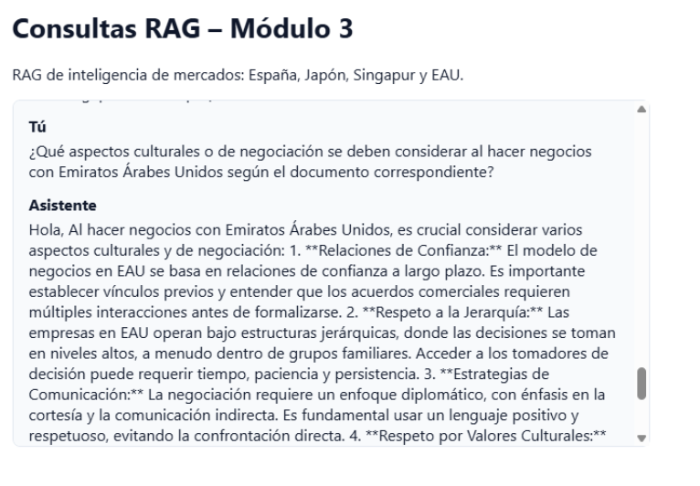
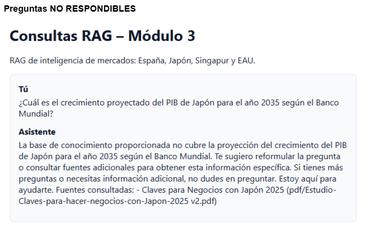

# Tareas Pendientes para Completar la Entrega

**Deadline:** Domingo 28 de Diciembre 2025, 23:59
**Estado actual:** Implementación técnica completa ✅
**Pendiente:** Evidencias y documentación de evaluación

---

## 🚨 CRÍTICO - Hacer ANTES de entregar

### 1. Completar URL de Deployment en README.md

**Archivo:** `README.md`
**Líneas a completar:**

- Sección 5.4 "URL del Servicio Deployado"

  ```markdown
  **URL principal:** `https://rag-mod3-app.fly.dev`
  **Playground:** `https://rag-mod3-app.fly.dev/rag/playground`
  ```

- Sección 12 al final del documento:
  ```markdown
  **Desarrollado por:** [Nombres del equipo]
  **Contacto:** [Email del equipo]
  **Repositorio:** [https://github.com/fsalfate1/tarea_modulo3_grupal]
  ```

**Acción requerida:**

1. Obtener la URL de Fly.io (debe ser algo como `https://rag-mod3-app.fly.dev`)
2. Reemplazar `[COMPLETAR CON URL DE FLY.IO]` con la URL real
3. Completar nombres del equipo, email y repositorio

---

### 2. Crear Archivo de Evaluación con Preguntas

**Archivo a crear:** `evaluacion_preguntas.md`

**Contenido requerido:**

```markdown
# Dataset de Evaluación - Sistema RAG Comercio Internacional

## Preguntas Respondibles (10-15 preguntas)

Preguntas cuya respuesta SÍ está disponible en los documentos indexados:

1. ¿Cuáles son los requisitos legales para establecer una empresa en Emiratos Árabes Unidos?
2. ¿Qué sectores económicos destacan en Singapur según el documento?
3. ¿Cuáles son las principales barreras culturales para hacer negocios en Japón?
4. ¿Qué tratados comerciales tiene España vigentes?
5. ¿Cuál es el sistema tributario en los EAU?
6. ¿Qué zonas francas existen en Emiratos Árabes Unidos?
7. ¿Qué recomendaciones se dan para exportar a Japón?
8. ¿Cuáles son los principales puertos de Singapur?
9. ¿Qué aspectos legales destacan para hacer negocios en España?
10. ¿Cuál es el análisis del sector minero presentado en el documento NoCobre NoLitio?
11. [AGREGAR 1-5 PREGUNTAS MÁS SEGÚN LO QUE CONTENGAN LOS PDFs]

## Preguntas No Respondibles (5-10 preguntas)

Preguntas sobre temas NO cubiertos en los documentos:

1. ¿Cuáles son los mejores restaurantes de Dubai?
2. ¿Cómo funciona el sistema educativo en Corea del Sur?
3. ¿Qué equipos de fútbol son más populares en España?
4. ¿Cuál es la población actual de Tokio?
5. ¿Qué medidas tomó Argentina contra la inflación en 2023?
6. ¿Cuál es el clima promedio en Singapur durante el verano?
7. ¿Qué monumentos históricos hay en Japón?
8. [AGREGAR 0-3 PREGUNTAS MÁS]

---

## Resultados de Evaluación

### Preguntas Respondibles - Resultados

#### Pregunta 1: ¿Cuáles son los requisitos legales para establecer una empresa en Emiratos Árabes Unidos?

**Respuesta del sistema:**
[COPIAR RESPUESTA REAL DEL SISTEMA AQUÍ]

**Evaluación:** ✅ Correcta / ❌ Incorrecta / ⚠️ Parcial

**Comentarios:** [Notas sobre la calidad de la respuesta]

---

[REPETIR PARA CADA PREGUNTA RESPONDIBLE]

---

### Preguntas No Respondibles - Resultados

#### Pregunta 1: ¿Cuáles son los mejores restaurantes de Dubai?

**Respuesta del sistema:**
[COPIAR RESPUESTA REAL DEL SISTEMA]

**Evaluación:** ✅ Respondió correctamente "No tengo información" / ❌ Intentó responder inventando

**Comentarios:** [Notas]

---

[REPETIR PARA CADA PREGUNTA NO RESPONDIBLE]

---

## Resumen de Evaluación

**Preguntas Respondibles:**

- Total: XX
- Correctas: XX (XX%)
- Incorrectas: XX (XX%)
- Parciales: XX (XX%)

**Preguntas No Respondibles:**

- Total: XX
- Correctamente rechazadas: XX (XX%)
- Alucinaciones: XX (XX%)

**Conclusión:** [Análisis general del desempeño del sistema]
```

**Cómo completar este archivo:**

1. **Generar preguntas respondibles:**

   - Leer los PDFs en la carpeta `pdf/`
   - Crear 10-15 preguntas cuyas respuestas están explícitamente en los documentos
   - Asegurarse de cubrir diferentes documentos

2. **Generar preguntas no respondibles:**

   - Crear 5-10 preguntas sobre temas claramente fuera del alcance
   - Evitar temas limítrofes (ej: no preguntar sobre Francia si hay un doc de España)

3. **Probar el sistema:**

   - Ir a `[URL]/rag/playground`
   - Hacer cada pregunta
   - Copiar la respuesta del sistema
   - Evaluar si es correcta

4. **Completar resultados:**
   - Para cada pregunta, documentar la respuesta
   - Evaluar con ✅ ❌ ⚠️
   - Agregar comentarios si es necesario

---

### 3. Capturar Screenshots de Evidencias

**Carpeta a crear:** `evidencias/`

**Screenshots requeridos:**

#### 3.1 Screenshot de Qdrant Dashboard

**Archivo:** `evidencias/qdrant_collection.png`

**Qué capturar:**

1. Ir a https://cloud.qdrant.io/
2. Acceder a tu cluster
3. Buscar la colección `rag_mod3_pdf_exportaciones`
4. Capturar screenshot mostrando:
   - Nombre de la colección
   - Número de vectores (puntos) indexados
   - Dimensionalidad (3072)
   - Estado: activa

**Ejemplo de lo que debe verse:**

```
Collection: rag_mod3_pdf_exportaciones
Vectors: XXX points
Dimensions: 3072
Status: Green (Active)
```

#### 3.2 Screenshot del Playground LangServe

**Archivo:** `evidencias/langserve_playground.png`

**Qué capturar:**

1. Ir a `[URL]/rag/playground`
2. Capturar la interfaz completa
3. Debe verse:
   - Título "RAG Módulo 3"
   - Campo de input
   - Botón de submit
   - Área de respuesta

#### 3.3 Screenshot de Pregunta Respondible

**Archivo:** `evidencias/pregunta_respondible.png`

**Qué capturar:**

1. En el playground, hacer una pregunta que SÍ puede responderse
2. Ejemplo: "¿Cuáles son los requisitos para hacer negocios en EAU?"
3. Esperar la respuesta
4. Capturar screenshot mostrando:
   - La pregunta
   - La respuesta completa del sistema
   - Las fuentes citadas

#### 3.4 Screenshot de Pregunta No Respondible

**Archivo:** `evidencias/pregunta_no_respondible.png`

**Qué capturar:**

1. En el playground, hacer una pregunta que NO puede responderse
2. Ejemplo: "¿Cuáles son los mejores restaurantes de Dubai?"
3. Esperar la respuesta
4. Capturar screenshot mostrando:
   - La pregunta
   - El mensaje "No tengo información suficiente" o similar
   - Verificar que NO inventó una respuesta

#### 3.5 (OPCIONAL) Screenshot de Logs de Carga

**Archivo:** `evidencias/data_preparation_logs.png`

**Qué capturar:**

1. Ejecutar `python rag_data_preparation.py`
2. Capturar la salida de consola mostrando:
   ```
   📂 Cargando PDFs…
   🧾 Extrayendo metadata…
   ✂️ Realizando semantic chunking…
   🗄️ Generando vector store en Qdrant…
   ✅ Preparación de datos finalizada.
   ```

---

### 4. (OPCIONAL) Agregar Sección de Evidencias al README

Si quieren incluir las imágenes directamente en el README:

**Al final del README.md, agregar:**

```markdown
## 13. Evidencias Visuales

### Colección en Qdrant Cloud


_Colección `rag_mod3_pdf_exportaciones` indexada con XXX vectores de 3072 dimensiones._

### LangServe Playground


_Interfaz de pruebas disponible en `/rag/playground`._

### Ejemplo: Pregunta Respondible



_Sistema respondiendo correctamente con información de los documentos._

### Ejemplo: Pregunta No Respondible



_Sistema indicando correctamente que no tiene información disponible._
```

---

## 📋 Checklist Completo de Entrega

Marcar con [x] cuando esté completo:

### Archivos de Código

- [x] `rag_data_preparation.py` - Script de carga
- [x] `rag_modulo3/preparation.py` - Lógica de chunking
- [x] `rag_modulo3/rag_chain.py` - Cadena RAG
- [x] `app/server.py` - Servidor LangServe
- [x] `requirements.txt` - Dependencias
- [x] `Dockerfile` + `fly.toml` - Deployment

### Documentación

- [x] `README.md` - Informe técnico base
- [ ] **PENDIENTE:** Completar URLs y nombres en README.md
- [x] ✅ **COMPLETADO:** `evaluacion_preguntas.md` - Dataset de evaluación (95.7% score general, 0 alucinaciones)

### Evidencias

- [ ] **PENDIENTE:** `evidencias/qdrant_collection.png`
- [ ] **PENDIENTE:** `evidencias/langserve_playground.png`
- [ ] **PENDIENTE:** `evidencias/pregunta_respondible.png`
- [ ] **PENDIENTE:** `evidencias/pregunta_no_respondible.png`
- [ ] OPCIONAL: `evidencias/data_preparation_logs.png`

### Sistema

- [x] ✅ Deployment activo en Fly.io
- [x] ✅ URL documentada en README (falta solo GitHub y nombres de integrantes)
- [x] ✅ Playground accesible y funcionando

---

## ⏱️ Estimación de Tiempo

**Tiempo total estimado:** 2-3 horas

| Tarea                                  | Tiempo estimado |
| -------------------------------------- | --------------- |
| Completar URLs en README               | 5 minutos       |
| Crear preguntas de evaluación          | 30-45 minutos   |
| Probar sistema y documentar respuestas | 45-60 minutos   |
| Capturar screenshots                   | 15-20 minutos   |
| Revisión final y verificación          | 15-20 minutos   |

---

## 🎯 Prioridades

1. **MÁXIMA PRIORIDAD:**

   - Crear `evaluacion_preguntas.md` con preguntas y respuestas
   - Capturar screenshot de Qdrant
   - Completar URL en README

2. **ALTA PRIORIDAD:**

   - Screenshots del playground funcionando
   - Screenshots de ejemplos de respuestas

3. **MEDIA PRIORIDAD:**
   - Screenshots de logs de carga
   - Agregar sección de evidencias visuales al README

---

## 📝 Notas Importantes

1. **Sobre las preguntas de evaluación:**

   - Deben ser preguntas REALES que alguien haría sobre los temas
   - Evitar preguntas obvias o triviales
   - Las preguntas no respondibles deben ser claramente fuera del dominio

2. **Sobre los screenshots:**

   - Asegurarse de que sean legibles
   - Formato PNG preferido
   - Ocultar cualquier información sensible si es necesario

3. **Sobre el README:**
   - Revisar que no quede ningún `[COMPLETAR...]` sin llenar
   - Verificar que los nombres del equipo estén correctos
   - Asegurarse de que la URL del deployment funcione

---

## ✅ Verificación Final Antes de Entregar

**Checklist de verificación:**

- [ ] README.md no contiene ningún `[COMPLETAR...]` o `[TODO...]`
- [x] ✅ Archivo `evaluacion_preguntas.md` existe y está completo (23 preguntas evaluadas)
- [ ] Carpeta `evidencias/` contiene al menos 4 screenshots
- [ ] La URL del deployment funciona y el playground es accesible
- [ ] Se probó al menos 3 preguntas en el playground y funcionan
- [ ] Los nombres del equipo y contacto están en el README
- [ ] Todos los archivos están en el repositorio Git
- [ ] Se hizo commit y push de todos los cambios

---

## 🚀 Comando Final de Verificación

Antes de entregar, ejecutar:

```bash
# Verificar que todos los archivos requeridos existen
ls README.md
ls evaluacion_preguntas.md
ls evidencias/qdrant_collection.png
ls evidencias/langserve_playground.png
ls evidencias/pregunta_respondible.png
ls evidencias/pregunta_no_respondible.png

# Verificar que el deployment funciona
curl [URL_DE_FLY_IO]/health

# Hacer commit final
git add .
git commit -m "Documentación completa para entrega final"
git push
```

---

**¡Éxito en la entrega!** 🎉
